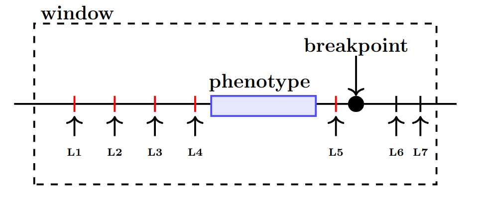

#  SegmentQTL

[](https://doi.org/10.1101/2025.07.28.667150)

**SegmentQTL** is a segmentation-aware molecular quantitative trait loci (molQTL) analysis tool designed for copy-number–driven cancers. It incorporates genomic segmentation data to improve QTL mapping accuracy by filtering out associations disrupted by structural variations. This approach prevents spurious signals caused by breakpoints, ensuring biologically meaningful genotype-phenotype associations.

SegmentQTL uses an **allele-specific genotype model**: each variant is represented by two log-ratio dosages, ALTlr (alternate allele) and REFlr (reference allele), supplied as separate per-chromosome files. From these, the tool internally derives the contrast `d = REFlr − ALTlr` used in association testing, and supports four analysis modes:

- **`nominal`** – per-variant association testing.
- **`perm`** – permutation-based gene-level scan with Freedman–Lane residualization.
- **`finemap`** – joint multi-variant fitting per cis-window using a missing-aware Elastic Net with stability selection.
- **`validate`** – assess generalization of finemapped models on an independent cohort.

The tool efficiently processes large datasets through multi-core parallelization.



## Contents

- [Installation](#installation)
- [Usage](#usage)
- [Input File Formats](#input-file-formats)
  - [1. Genotype Files (Per-Chromosome ALTlr / REFlr CSVs)](#1-genotype-files-per-chromosome-altlr--reflr-csvs)
  - [2. Phenotype Quantifications (CSV)](#2-phenotype-quantifications-csv)
  - [3. Covariate File (CSV)](#3-covariate-file-csv)
  - [4. Copy Number File (CSV)](#4-copy-number-file-csv)
  - [5. Segmentation File (CSV)](#5-segmentation-file-csv)
  - [6. Phenotype-Level Covariate File (CSV, optional)](#6-phenotype-level-covariate-file-csv-optional)
- [Output Format](#output-format)
  - [Nominal / Permutation Output](#nominal--permutation-output)
  - [Finemapping Output](#finemapping-output)
  - [Validation Output](#validation-output)
- [Examples](#examples)
- [Citation](#citation)

## Installation

Requiring preinstalled Python and pip (Python package installer).

```bash
git clone https://github.com/HautaniemiLab/SegmentQTL.git
cd SegmentQTL

# (Optional, but recommended) Create a virtual environment
python -m venv <my-venv>
source <my-venv>/bin/activate

pip install -r requirements.txt
```

## Usage

SegmentQTL is executed via the command line with various options to control input data, analysis modes, and computational resources. The key arguments are:

### Required Arguments:
- `--mode`
  - Specifies the analysis mode:
    - `nominal`: per-variant association testing.
    - `perm`: permutation-based gene-level scan.
    - `finemap`: joint Elastic Net finemapping per cis-window.
    - `validate`: validation of finemap models on an independent cohort.
- `--chromosome`
  - Chromosome number (e.g., `21` or `X`). Supports `chr` prefix (e.g., `chr21`).
- `--genotypes`
  - Path to genotype data directory containing per-chromosome ALTlr / REFlr CSVs (see [Genotype Files](#1-genotype-files-per-chromosome-altlr--reflr-csvs)).
- `--quantifications`
  - Path to CSV file containing phenotype quantifications (e.g., gene expression). Provide the file with quantifications for the whole genome.
- `--covariates`
  - Path to CSV file with sample-level covariate data.
- `--copynumber`
  - Path to CSV file with phenotype-level copy-number data (CNlr). In `perm` mode it is required for Freedman–Lane residualization; in `finemap`/`validate` it is included as an unpenalised predictor.
- `--segmentation`
  - Path to segmentation file with breakpoint data.
- `--out_dir`
  - Directory where results are saved.

### Common Optional Arguments:
- `--phenotype_covariate`
  - Path to additional phenotype-level covariate CSV. Optional; treated as an unpenalised predictor in `finemap`/`validate`.
- `--window`
  - Window size in base pairs for cis-mapping (default: `1,000,000` bp).
- `--num_cores`
  - Number of CPU cores to use for parallel processing (default: `1`).
- `--all_variants`
  - (nominal mode) Test all variants for a given phenotype. Provide a phenotype ID or use without a value to process all phenotypes.
- `--perm_method`
  - (perm mode) Method used for permutation (`beta` or `direct`). Default: `beta`.
- `--num_permutations`
  - (perm mode) Number of permutations per phenotype (default: `5000`).
- `--record_aic`
  - (nominal/perm mode) Record AIC scores for associations.
- `--neg_control`
  - (nominal/perm mode) Run trans negative-control mode. For each gene on chromosome *c*, tests variants from chromosome *c+1* (wrapping). Used for calibration diagnostics.

### Finemapping Optional Arguments:
- `--alpha_en` – Elastic Net mixing parameter (1 = Lasso, 0 = Ridge). Default: `0.5`.
- `--coverage_tau` – Minimum fraction of samples observed for a variant. Default: `0.6`.
- `--n_bootstrap` – Number of stability-selection bootstrap resamples. Default: `200`.
- `--subsample_frac` – Fraction of samples per bootstrap resample. Default: `0.8`.
- `--n_lambda` – Number of lambda grid points for CV-based selection. Default: `30`.
- `--lambda_ratio` – Lower-bound ratio `lam_min / lam_max`. Default: `0.01`.
- `--cv_tau` – Range-based CV tolerance for sparsity. Default: `0.8`.
- `--min_obs_boot` – Minimum observed entries per variant within each bootstrap subsample. Default: `20`.
- `--phenotype_id` – Restrict run to a single phenotype.
- `--compute_r2` – Compute R² for baseline vs full model and include in output.
- `--r2_stability_threshold` – Minimum stability score for variant selection in R² computation. Default: `0.6`.

### Validation Optional Arguments:
Validation reuses the discovery (main) cohort inputs (`--genotypes`, `--quantifications`, `--covariates`, `--segmentation`, `--copynumber`, `--phenotype_covariate`) and adds an independent cohort:

- `--val_genotypes`, `--val_quantifications`, `--val_segmentation` – required validation-cohort inputs.
- `--val_covariates`, `--val_copynumber`, `--val_phenotype_covariate` – optional validation-cohort inputs.
- `--validation_mode` – `recalibrated` (default) refits the unpenalised block on validation and freezes the genetic component; `frozen` reuses everything from the discovery fit.
- `--finemap_results_dir` – Reuse pre-computed `finemap_<chr>.csv` (recommended). Skips refitting the Elastic Net.
- `--validate_with_bootstrap` / `--validation_stability_threshold` – Mask discovery betas below a stability threshold.
- `--restrict_to_supported_phenotypes`, `--support_definition`, `--support_min_stability` – Limit validation scoring to phenotypes supported in discovery.
- `--bootstrap_ci` / `--n_boot_ci` – Paired bootstrap CIs for R² and calibration slope.
- `--n_permutations` – Validation phenotype-label permutation null (set `> 0` to enable).
- `--save_model_audit` – Write a long-format per-phenotype model audit CSV.

## Input File Formats

SegmentQTL requires five main inputs: genotypes (ALTlr + REFlr per chromosome), quantifications, sample covariates, copy number, and segmentation. An optional sixth input adds phenotype-level covariates. Below are the required formats and examples for each.

---

#### 1. Genotype Files (Per-Chromosome ALTlr / REFlr CSVs)

The `--genotypes` argument should point to a directory containing **two files per chromosome**, one for each allele:

```
genotypes/
  chr1_ALTlr.csv
  chr1_REFlr.csv
  chr2_ALTlr.csv
  chr2_REFlr.csv
  ...
  chrX_ALTlr.csv
  chrX_REFlr.csv
```

Each pair encodes log-ratio allelic dosages for the same set of variants and samples.

##### **Required Columns:**
- **`ID`**: Variant identifier in the format `chr:pos:ref:alt` (e.g., `chr8:123456:A:G`). The `ID` column must be identical (and in the same order) between the ALTlr and REFlr files of a chromosome.
- **`<sample1>`**, **`<sample2>`**, ...: Per-sample log-ratio dosage values.

##### **Required input transform (computed by the user upstream):**
SegmentQTL does not perform this normalization itself; it assumes the genotype files already contain the floored, shifted log-ratios

$$
\begin{aligned}
\mathrm{ALTlr} &= \max\!\left(\log_2\!\left(\frac{\mathrm{ALTcn}}{\mathrm{ploidy}}\right),\, -2\right) + 2, \\
\mathrm{REFlr} &= \max\!\left(\log_2\!\left(\frac{\mathrm{REFcn}}{\mathrm{ploidy}}\right),\, -2\right) + 2,
\end{aligned}
$$

where `ALTcn` / `REFcn` are the alternate / reference allele copy numbers and `ploidy` is the sample ploidy. Internally SegmentQTL works with the contrast `d = REFlr − ALTlr`.

See [AlleleDoser](https://github.com/HautaniemiLab/AlleleDoser) for upstream computation.

##### **Example File Format (`chr8_ALTlr.csv`):**

| ID                | sample1 | sample2 | sample3 |
|-------------------|---------|---------|---------|
| chr8:123456:A:G   | 1.85    | 2.10    | 0.40    |
| chr8:123789:T:C   | 2.00    | 1.95    | 1.20    |

`chr8_REFlr.csv` has the identical `ID` column with the corresponding REFlr values.

---

#### 2. Phenotype Quantifications (CSV)

The `--quantifications` argument should point to a CSV file containing normalized phenotype levels (e.g., gene expression) for all samples across the genome.

##### **Required Columns:**
- **`chr`**: Chromosome where the phenotype is located (e.g., `chr1`, `chrX`).
- **`start`**: Start position of the phenotype.
- **`end`**: End position of the phenotype.
- **`gene_id`**: Unique identifier for the phenotype (e.g., Ensembl gene ID).

##### **Additional Columns:**
- **`<sample1>`**, **`<sample2>`**, ...: Normalized phenotype values per sample.

##### **Example File Format:**

| chr    | start   | end     | gene_id       | sample1 | sample2 | sample3 |
|--------|---------|---------|---------------|---------|---------|---------|
| chr8   | 123000  | 124000  | ENSG00000123  | 1.21    | 0.98    | 1.34    |
| chr8   | 130000  | 132000  | ENSG00000456  | 0.87    | 1.05    | 0.92    |


---

#### 3. Covariate File (CSV)

The `--covariates` argument should point to a CSV file containing sample-level covariate values. First row has `n` entries (samples); subsequent rows have `n + 1` entries (covariate name + values).

##### **Structure:**
- **Row 1**: Sample IDs only (e.g., `sample1,sample2,sample3`)
- **Row 2+**: First cell is the covariate name, followed by values for each sample.

---

#### 4. Copy Number File (CSV)

The `--copynumber` argument should point to a CSV file containing phenotype-level copy number values (CNlr) for each sample.

##### **Required Columns:**
- **`gene_id`**: Ensembl gene ID or equivalent identifier.

##### **Additional Columns:**
- **`<sample1>`**, **`<sample2>`**, ...: Copy number values per sample.

##### **Example File Format:**

| gene_id       | sample1 | sample2 | sample3 |
|---------------|---------|---------|---------|
| ENSG00000123  | 2.10    | 1.85    | 1.92    |
| ENSG00000456  | 1.75    | 2.30    | 2.00    |

---

#### 5. Segmentation File (CSV)

The `--segmentation` argument should point to a CSV file with structural segmentation data for each sample. This is used to determine if a variant and gene are on the same intact genomic segment.

##### **Required Columns:**
- **`sample`**: Sample ID.
- **`chr`**: Chromosome identifier.
- **`startpos`**: Start coordinate of the segment.
- **`endpos`**: End coordinate of the segment.

##### **Example File Format:**

| sample   | chr   | startpos | endpos  |
|----------|-------|----------|---------|
| sample1  | chr8  | 100000   | 200000  |
| sample1  | chr8  | 200001   | 300000  |
| sample2  | chr8  | 120000   | 250000  |

---

#### 6. Phenotype-Level Covariate File (CSV, optional)

The optional `--phenotype_covariate` argument points to a CSV with one phenotype-level covariate per sample (same layout as the copy number file). When provided, it is included as an unpenalised predictor in `finemap` and `validate`.

## Output Format

### Nominal / Permutation Output

The primary output of `nominal` / `perm` modes is a CSV with per-(phenotype, variant) statistics.

| Column Name          | Description                                                                                |
|----------------------|--------------------------------------------------------------------------------------------|
| `phenotype`          | Phenotype identifier.                                                                      |
| `variant`            | Variant identifier (best variant per phenotype in `perm` mode).                            |
| `number_of_samples`  | Effective number of samples after segment-consistency filtering.                           |
| `beta_s`             | Slope on the sum `s = REFlr + ALTlr` (allelic-burden / dosage covariate).                  |
| `se_s`               | Standard error of `beta_s`.                                                                |
| `beta_d`             | Slope on the contrast `d = REFlr − ALTlr` (allele-specific effect of interest).            |
| `se_d`               | Standard error of `beta_d`.                                                                |
| `t_stat_d`           | t-statistic for `beta_d`.                                                                  |
| `nominal_p`          | Nominal p-value for `beta_d`.                                                              |
| `r2_alt`             | R² of the alternative model.                                                               |
| `p_adj`              | Permutation-adjusted p-value (`perm` mode only; NaN in `nominal`).                         |
| `chr`                | Chromosome.                                                                                |

When `--record_aic` is set, additional columns `aic_null`, `aic_alt`, `delta_aic_alt_minus_null` are written.

### Finemapping Output

`finemap` mode writes `finemap_<chr>.csv` with one row per (phenotype, selected variant). Key columns include `phenotype`, `variant`, `n_samples`, `n_variants`, `mean_d`, `sd_d`, `stability_score`, `mean_beta`, `sign_consistency`, `lambda_selected`, `beta_full` (refit Elastic Net coefficient on standardised `d`), `beta_full_raw` (back-transformed to raw `d`), `beta_cnlr`, and `effect_interpretation`. A companion `finemap_bootstrap_nonzero_<chr>.csv` records per-bootstrap selections, and `finemap_r2_<chr>.csv` is written when `--compute_r2` is set.

### Validation Output

`validate` mode writes three files: `validate_<chr>.csv` (per-phenotype generalization metrics), `validate_residuals_<chr>.csv` (per-(phenotype, validation sample) predictions and residuals), and `validate_model_<chr>.csv` (long-format model audit; only when `--save_model_audit` is set). Metrics include RMSE/MAE, descriptive R², calibration (intercept + slope with HC3 robust Wald test), genetic transfer slope rho, burden-stratified R², and optional bootstrap and permutation p-values.

## Examples

These examples assume your inputs follow the layout described above and that you are at the root of the `SegmentQTL` folder.

### 1. Nominal Mapping
Per-variant nominal association testing on chromosome 8 with 4 cores:

```bash
python -m segmentqtl --mode nominal --chromosome 8 --num_cores 4 \
    --genotypes data/genotypes --quantifications data/quantifications.csv \
    --covariates data/covariates.csv --copynumber data/copynumbers.csv \
    --segmentation data/segments.csv --out_dir results/
```

### 2. Permutation-Based Mapping
Gene-level scan with 1000 permutations using the beta approximation:

```bash
python -m segmentqtl --mode perm --chromosome 8 --num_permutations 1000 \
    --perm_method beta --num_cores 4 \
    --genotypes data/genotypes --quantifications data/quantifications.csv \
    --covariates data/covariates.csv --copynumber data/copynumbers.csv \
    --segmentation data/segments.csv --out_dir results/
```

### 3. Finemapping
Joint Elastic Net finemapping with stability selection on chromosome 8:

```bash
python -m segmentqtl --mode finemap --chromosome 8 --num_cores 4 \
    --genotypes data/genotypes --quantifications data/quantifications.csv \
    --covariates data/covariates.csv --copynumber data/copynumbers.csv \
    --segmentation data/segments.csv \
    --n_bootstrap 200 --compute_r2 --out_dir results/
```

### 4. Validation on an Independent Cohort
Reuse a prior finemap run and validate on a held-out cohort, restricting scoring to discovery-supported phenotypes:

```bash
python -m segmentqtl --mode validate --chromosome 8 --num_cores 4 \
    --genotypes data/genotypes --quantifications data/quantifications.csv \
    --covariates data/covariates.csv --copynumber data/copynumbers.csv \
    --segmentation data/segments.csv \
    --val_genotypes valdata/genotypes --val_quantifications valdata/quantifications.csv \
    --val_covariates valdata/covariates.csv --val_copynumber valdata/copynumbers.csv \
    --val_segmentation valdata/segments.csv \
    --finemap_results_dir results/ \
    --restrict_to_supported_phenotypes --support_min_stability 0.6 \
    --out_dir validation_results/
```

### 5. Testing All Variants for a Specific Phenotype
Run all applicable variants for one phenotype:

```bash
python -m segmentqtl --mode nominal --all_variants ENSG00000003987 \
    --chromosome 8 --num_cores 1 \
    --genotypes data/genotypes --quantifications data/quantifications.csv \
    --covariates data/covariates.csv --copynumber data/copynumbers.csv \
    --segmentation data/segments.csv --out_dir results/
```

## Citation

If you use SegmentQTL in your work, please cite:

Samuel Leppiniemi, et al. *SegmentQTL: Identifying genetic variants influencing molecular phenotypes in copy number-driven cancers.* bioRxiv, 2025. [https://doi.org/10.1101/2025.07.28.667150](https://doi.org/10.1101/2025.07.28.667150)
